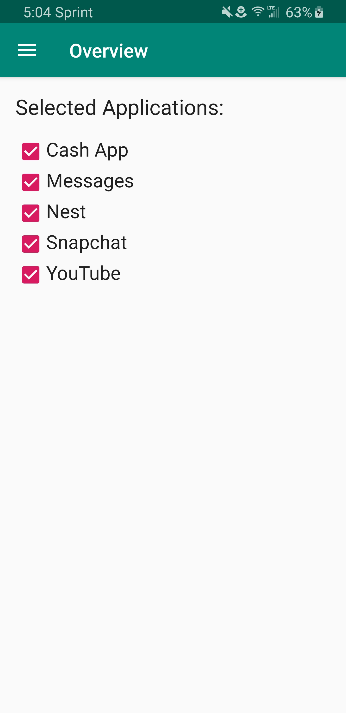
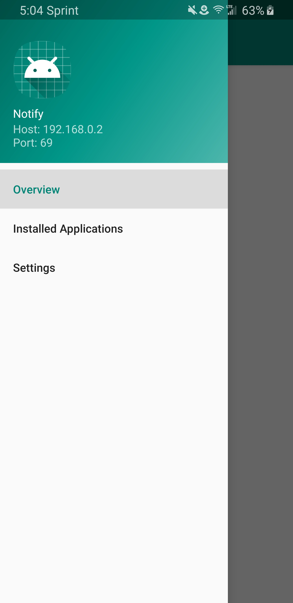
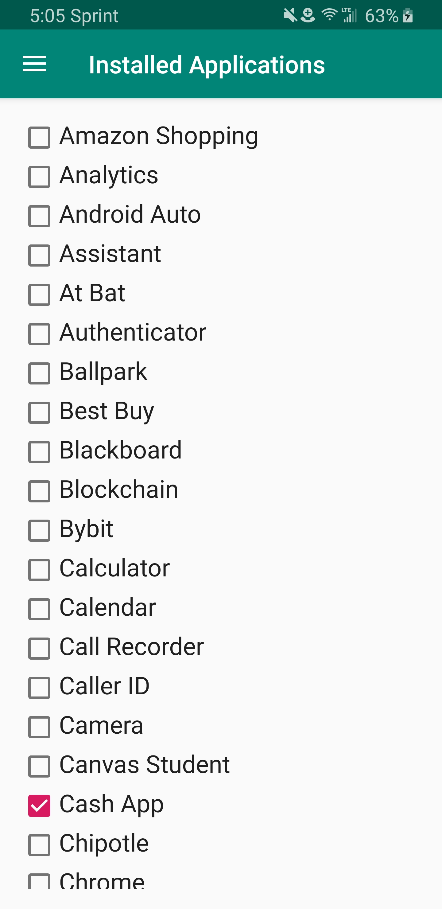
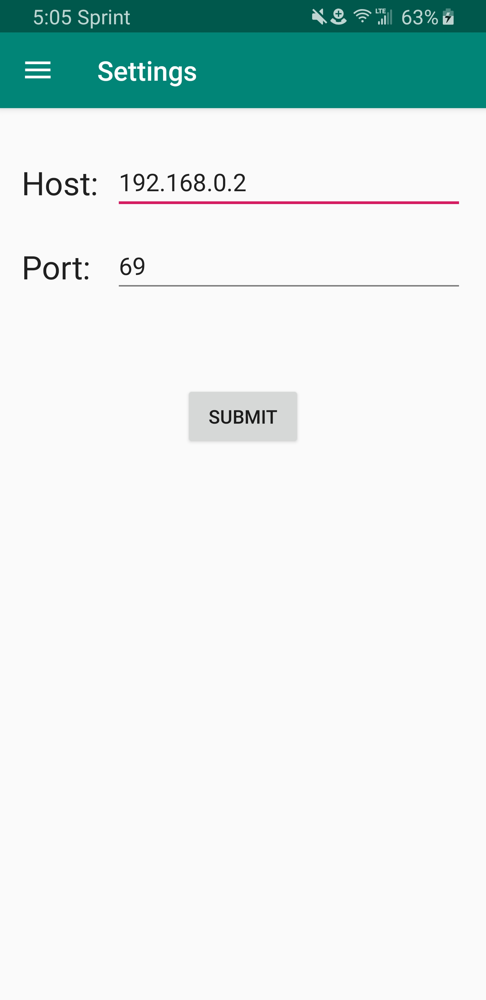

# Notify
Android application that forwards notifications of selected apps to a specified server

## Setup
The application must be allowed notification access in settings in order to work properly.

**Do not use this application over a public or unsecured network. Requests are sent thought cleartext HTTP at the moment.**

   

## Author
James Peccia
